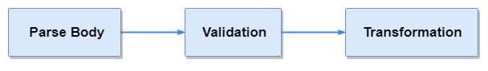

# DTO

## General

**DTO**\(_Data Transfer Object_\) __is used for parsing and validating data from request body. DTOs always used with **Controllers**.

## Validation

It's a common scenario when web server should validate data before processing. DTO can optimize and automate this process.

### Overview

Let's imagine that we need to implement this API.



Accepts `application/json` in following format:

```typescript
{
  title: string,
  description: string
}
```

With following limitations:

* `title` - required, max length - 80 chars. 
* `description` - optional, max length - 255 chars.



Return id in response

```typescript
10125
```



Let's start from **DTO** class

```typescript
import { Data, IsOptional, MaxLength } from "odi/dto";

@Data()
export class TodoDTO {

    @MaxLength(80)
    title: string;

    @IsOptional()
    @MaxLength(255)
    desctiption: string;
    
}
```

And controller with some predefined service

```typescript
import { Controller, IController, Post, Autowired } from "odi";
import TodoService from "./todo.service";

@Controller('/todo')
export class TodoController extends IController {
    
    @Autowired()
    todoService: TodoService;   
         
    @Post async index(payload: TodoDTO) {
        const { id } = await this.todoService.create(payload);
                
        return id;
    }

}
```

Data from request body will be automatically injected and validated. If validation failed - errors will be automatically sent to client.

### DTO definition

### Decorators for validation

There are set of decorators for convenient data validation. If you have special needs on validation, you can always implement your own decorator \(read more in advanced\). But custom decorators can be implemented. Read in Advanced about it.

Decorators can be grouped by data type

#### General

This decorators can be applied to any type of data.

* `@IsOptional()` - set field optional \(_by default, all fields are required_\) 
* `@Const(value: any)` - field is valid if it is deeply equal to the passed value 
* `@Deafault(value: any)` - default value for field, if it not exists 
* `@Enum(enumrable: any[])` - data is valid if it is deeply equal to one of items in the array 
* `@Nested()` - validate nested DTO class, otherwise field will be ignored 

Decorator `@Nested` should be applied on field, which type is DTO class.

#### String

* `@MaxLength(maxLength: number)` - data to be valid should have length satisfying this rule 
* `@MinLength(minLength: number)` - data to be valid should have length satisfying this rule 
* `@Pattern(pattern: string | RegExp)` - data to be valid should match the regular expression 
* `@Format(format: ValidatorFormat)` - data to be valid should match the format 
* `@IsEmail()`- data to be valid should be email \(`Format` alias\) 
* `@IsUrl()` - data to be valid should be url \(`Format` alias\)

Following formats for `@Format` decorator available:

```typescript
"date"
"time"
"date-time"
"uri"
"uri-reference"
"uri-template"
"url"
"email"
"hostname"
"ipv4"
"ipv6"
"regex"
"uuid"
"json-pointer"
"relative-json-pointer"
```

#### Number

* `@Maximum(maximum: number)` -  data to be valid should be `<=` maximum 
* `@Minimum(minimum: number)` -  data to be valid should be `>=` minumum 
* `@ExclusiveMaximum(exclusiveMaximum: number)` -  data to be valid should be `<` maximum

* `@ExclusiveMinimum(exclusiveMinimum: number)` -  data to be valid should be `>` minimum 
* `@MultipleOf(multipleOf: number)`-  data to be valid should be a multiple of the `multipleOf` 

#### Array

* `@ArrayOf(targetClass: any)` -  sets type of array items 
* `@UniqueItems()`- array to be valid should have unique items 
* `@MaxItems(maxItems: number)`-  array to be valid should not have less items than the `maxItems`

* `@MinItems(minItems: number)` - array to be valid should not have more items than the `minItems`

`@ArraoyOf` must be used, if array item type is another DTO class. As typescript does not provide reflection for complex types, type should be setted manually.

#### Others

* `@CustomValidation(validate: ValidateFunction, params: any = true)` - define custom validation function for field. Validate function can be async.

## Transformation

Data transformation from plain object to DTO instance applied automatically. But don't forget about `@ArraoyOf` decorator for DTOs arrays.

### Future


Decorators for transformations will be added in next major release.


## Inheritance

You can easily use inheritance `(extends)` for DTOs.

```typescript
import { Data, Format, MaxLength, IsOptional } from "odi/dto";

@Data()
class BaseDTO {
    
    @Format('uuid')
    id: string;
    
}

@Data()
class TodoDTO extends BaseDTO {

    @MaxLength(80)
    title: string;

    @IsOptional()
    desctiption: string;
        
}
```

`TodoDTO` will inherit all properties from base class for both transformation and validation purposes.

## Flow

Every controller method, that contains **DTO** class as argument will be automatically provided with validated and mapped data. Validation will be performed before controller method call.



Only after transformation, DTO will be injected into method call. Under the hood [ajv](https://ajv.js.org) is used. Decorators is used to build schema.

## 

## 


