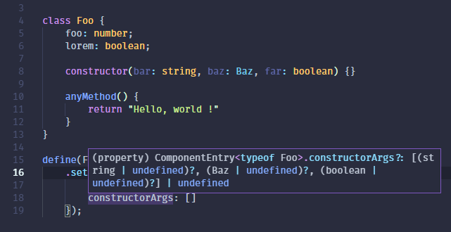

# Getting Started

## Installation

1. Install npm package `npm install odi --save`
2. Install reflect-metadata  `npm install reflect-metadata --save`
3. Import reflect-metadata \(for example in `index.ts`\): `import "reflect-metadata";`
4. Enabled the following settings in `tsconfig.json`

   ```javascript
   "emitDecoratorMetadata":  true, 
   "experimentalDecorators":  true
   ```

## Hello World application

First of all, let's create simple controller `hello.controller.ts`

```typescript
import { Controller, IController, Get } from 'odi';

@Controller()
export class HelloController extends IController {

    @Get index() {
        return "Hello world !";
    }

}
```

And our startup file `index.ts`

```typescript
import "reflect-metadata";
import { Core } from "odi";

const port = 8080;
const sources = __dirname;

new Core({ server: { port }, sources }).listen();
```

Build your application and run it `tsc && node index.js`  Check it in your browser 



It was just a basic example. There are many other interesting things. Check docs for further information.

